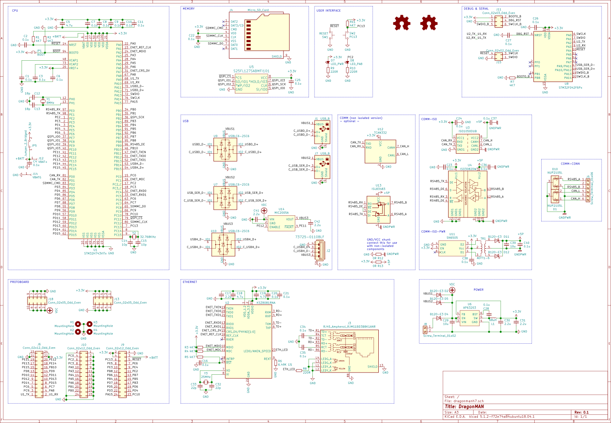
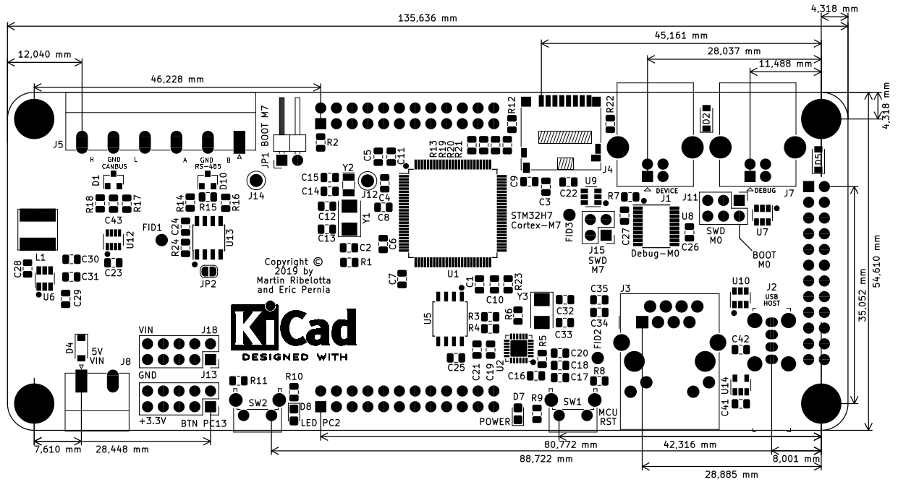
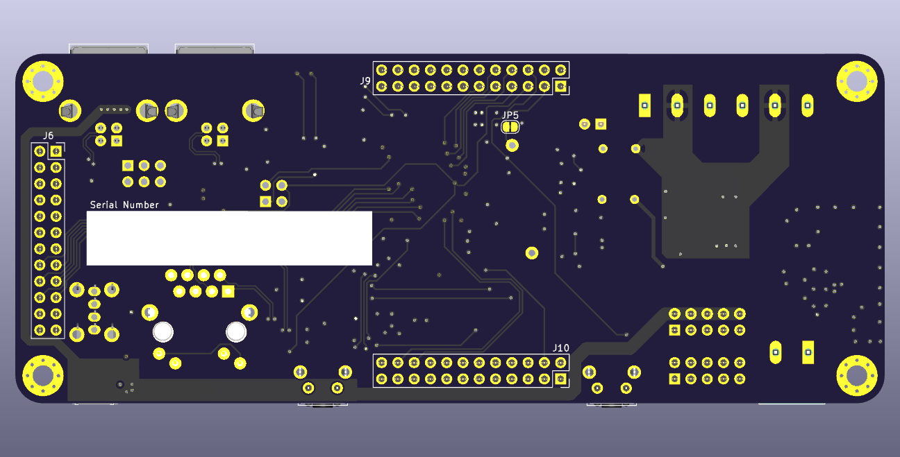
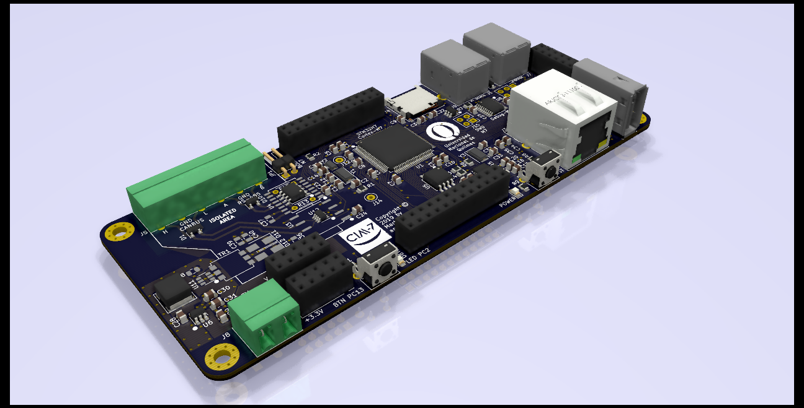
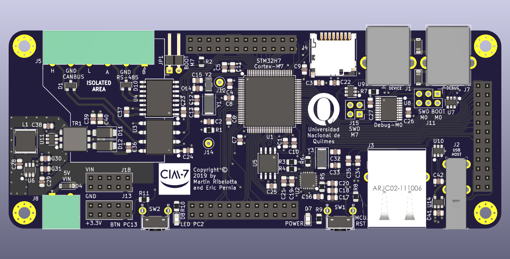
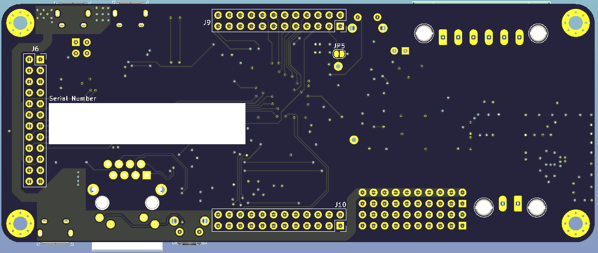
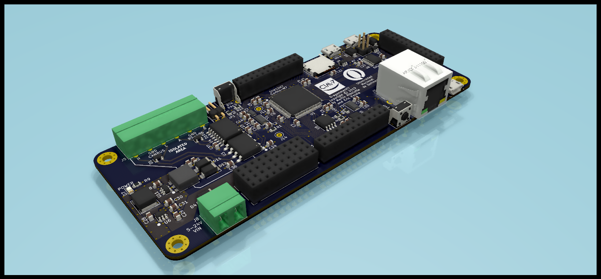

# H7-DragonMAN board

STM32H7 LQFP100 board for protocol bridge and industrial control.

## Characterstics:

 - STM32H750/743VxTx in 144LQFP with 8MHz/32.768Khz crystals
 - STM32-based DAP programmer and virtual usb
 - External 2/4/8/16MB QSPI flash
 - MicroSD card 1bit slot
 - Two usb otg (FS and HS)
 - 10/100Mb ETH via KSZ8081 in RMII mode
 - RS485 isolated or non-isolated
 - CANBUS isolated or non-isolated
 - Isolated step-up for CANBUS/RS-485 tranceivers
 - One user button
 - One user led
 - 5-24V input via AP63203 DC-DC regulator

## Schematic

## Board dimentions

## 3D preview

# Non isolated

# Isolated isolated

